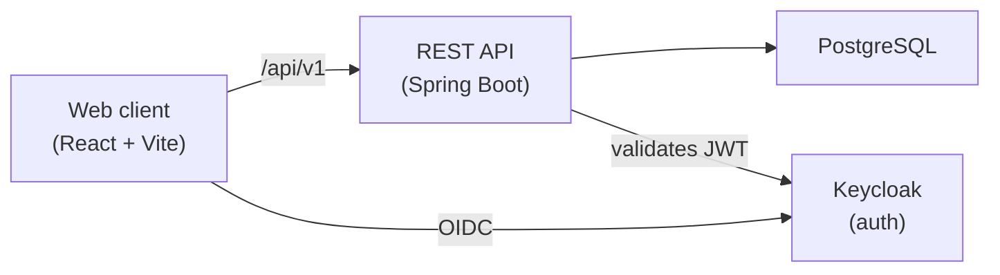

# Evently

A full-stack event ticketing platform — create events, sell tickets, and validate entry at the door with QR codes. Built with a Spring Boot REST API, a React frontend, and PostgreSQL.

The platform is built around three kinds of users:

- **Organizers** set up events, define ticket types and pricing, and track sales.
- **Attendees** discover events, buy tickets, and carry a QR code for entry.
- **Staff** scan and validate those QR codes at the venue.

## Architecture



## Tech

**Frontend** — React 19, TypeScript, Vite, Tailwind CSS, Radix UI, React Router. OIDC login via Keycloak. See [`frontend/ARCHITECTURE.md`](frontend/ARCHITECTURE.md) for a full write-up.

**Backend** — Java 21, Spring Boot, Spring Data JPA, PostgreSQL, MapStruct. Exposes the `/api/v1` REST API the frontend consumes.

## Repository layout

```
evently/
  frontend/    React single-page app (this is the more complete half today)
  backend/     Spring Boot API  (in progress)
  compose.yaml infrastructure for local dev: Postgres + Keycloak
```

## Roadmap

The project is being built in two passes.

**1. Baseline** — get the full lifecycle working end to end: event CRUD, published-event browsing and search, ticket purchase, QR generation, and ticket validation, all behind role-based access.

**2. Hardening** — the parts I care most about and want to be able to defend:

- Concurrency-safe ticket purchasing (row locking + an oversell guard, proven with a load test).
- Idempotent purchase endpoint so a retried request can't double-book.
- Custom JWT auth (access/refresh split, refresh-token rotation with reuse detection, Argon2id password hashing).
- Integration tests against a real PostgreSQL via Testcontainers.
- Metrics and structured request logging.

## Running locally

The frontend runs today against a mock API:

```bash
cd frontend
npm install
npm run mocks      # mock API (json-server)
npm run dev        # http://localhost:5173
```

Once the backend is up, bring up Postgres and Keycloak with `docker compose up -d`, start the Spring Boot app, and point the frontend at it on `/api/v1`. Quickstart steps will be filled in here as the backend lands.

## License

MIT — see [`LICENSE`](LICENSE).
