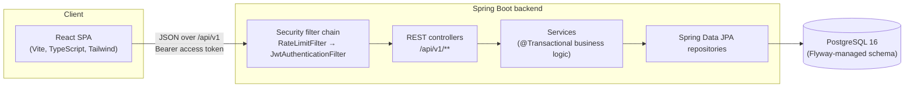
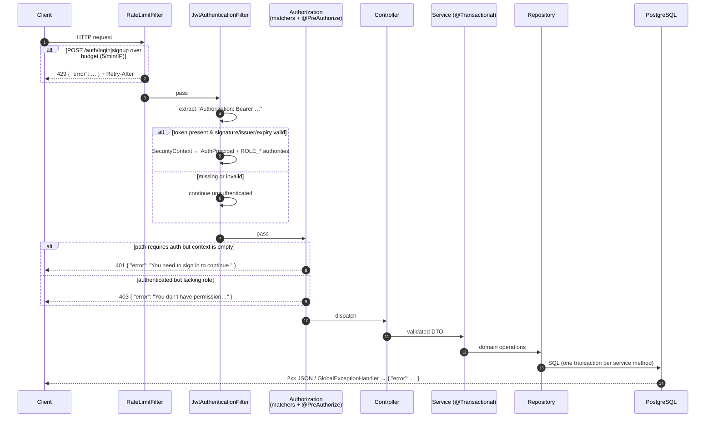
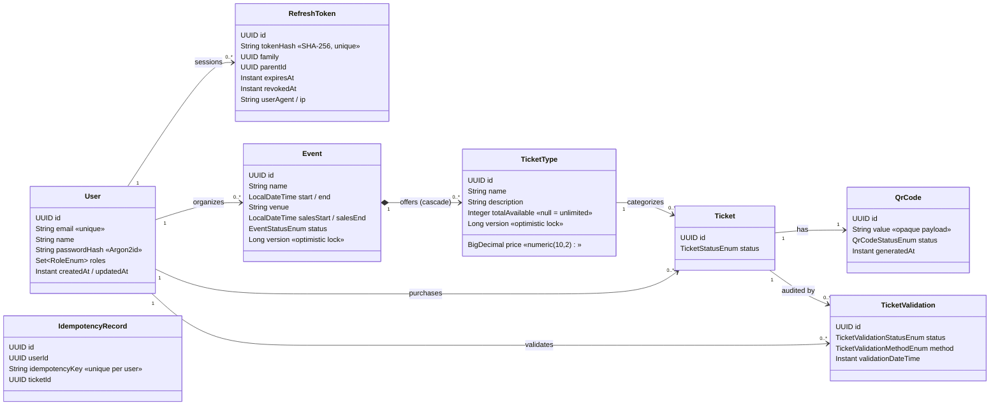
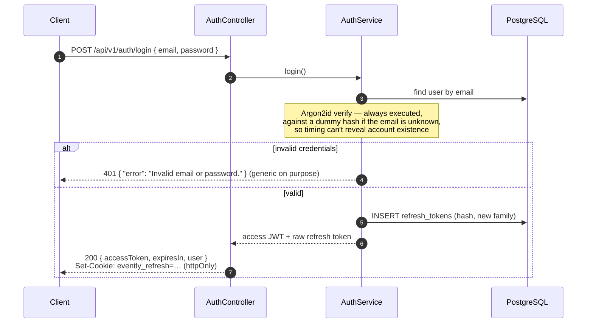
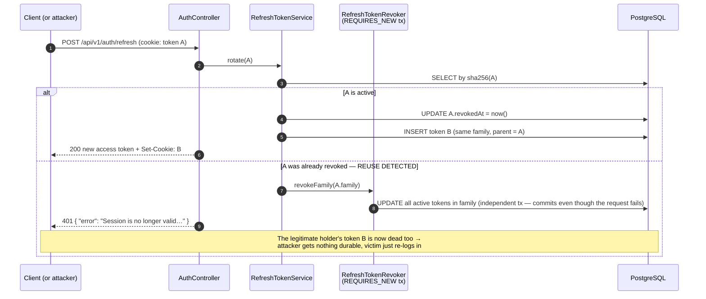
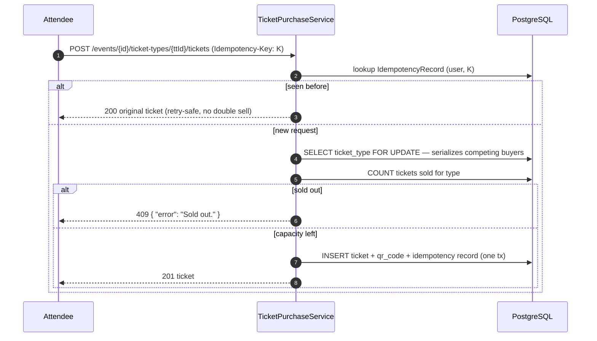

# Evently

A full-stack event ticketing platform — organizers create events and ticket tiers, attendees discover events and buy tickets, and staff validate entry at the door with QR codes.

Built as a **React SPA** over a **Spring Boot REST API** on **PostgreSQL**, with **authentication implemented from scratch** (no Keycloak / no managed IdP): Ed25519-signed JWT access tokens, rotating refresh tokens with reuse detection, and Argon2id password hashing.

## What it does

Evently covers the full lifecycle of an event ticket, across three roles:

- **Organizers** create events with multiple admission tiers (name, price, description, optional capacity), edit them with the tier set reconciled in place (update / add / remove in one request), and control visibility through a draft → published → cancelled/completed lifecycle. Every operation is scoped to the owning organizer — someone else's event id behaves as not-found.
- **Attendees** browse and search published events (case-insensitive, across name and venue), buy tickets, and carry each ticket's QR code — rendered on demand from an opaque 256-bit credential that reveals nothing about the ticket itself.
- **Staff** validate tickets at the door by QR scan or manual entry. A ticket admits exactly once: the first scan consumes its credential, repeat scans answer `EXPIRED`, forged or mistyped values answer `INVALID`, and every attempt against a real ticket lands in an audit trail.

The engineering highlights:

- **Oversell-safe purchasing** — the tier row is locked (`SELECT … FOR UPDATE`) before the capacity check, so concurrent buyers serialize per tier while different tiers sell in parallel. A k6 load test of **200 concurrent buyers against 50 seats settles at exactly 50 sales** ([results committed](backend/loadtest/results.md)).
- **Idempotent purchases** — an `Idempotency-Key` header maps retries back to the original ticket, so a client that times out and retries can never buy twice.
- **Authentication built from scratch** — Ed25519-signed JWT access tokens, rotating refresh tokens with reuse detection, Argon2id password hashing, per-IP rate limiting, and timing-equalized login responses.
- **Tested against the real thing** — 16 integration tests run against real PostgreSQL (never H2) via `mvn verify`, including two multi-threaded race tests for the purchase and validation paths. The API ships an [OpenAPI spec](backend/openapi.json), request-id-correlated logs, and Prometheus metrics.

Design rationale for every non-obvious choice lives in [`DECISIONS.md`](DECISIONS.md).

---

## System architecture



There is intentionally **no external auth server**. The backend is its own identity provider:

- **Access tokens** are stateless JWTs signed with an **Ed25519** private key; every instance can verify them with just the public key — no DB hit per request.
- **Refresh tokens** are opaque 256-bit random values, delivered only in an `httpOnly` cookie and stored server-side **as SHA-256 hashes** — so a database leak alone cannot forge a session.
- Postgres is the single source of truth; the schema is owned by **Flyway migrations** (Hibernate runs in `validate` mode and is never allowed to mutate DDL).

### Why build auth from scratch (vs. Keycloak)?

This project deliberately implements the full OAuth-style token lifecycle by hand — password hashing, token minting, rotation, revocation, reuse detection — because those mechanics are the interesting engineering. The trade-offs of that decision (and each primitive chosen) are documented in [Design decisions](#design-decisions).

---

## Backend architecture in detail

### Package structure

```
backend/src/main/java/com/evently/
├── EventlyApplication.java     Spring Boot entry point (+ JPA auditing, config-props scan)
├── config/                     Wiring & typed configuration
│   ├── SecurityConfig          Stateless filter chain, public paths, 401/403 JSON writers
│   ├── PasswordConfig          Argon2id PasswordEncoder bean
│   ├── JwtProperties           app.jwt.*   (issuer, TTLs, key locations)
│   ├── CookieProperties        app.cookie.* (refresh-cookie attributes)
│   └── RateLimitProperties     app.rate-limit.*
├── domain/                     JPA entities + enums (persistence model)
├── repo/                       Spring Data repositories (incl. the pessimistic-lock query)
├── security/                   Auth machinery
│   ├── JwtService              Ed25519 sign/verify, claims ↔ AuthPrincipal
│   ├── JwtAuthenticationFilter Bearer-token authentication per request
│   ├── RefreshTokenService     issue / rotate / revoke + reuse detection
│   ├── RefreshTokenRevoker     family revocation in REQUIRES_NEW transaction
│   ├── RateLimitFilter         Bucket4j per-IP throttle on login/signup
│   └── AuthPrincipal           record placed in the SecurityContext
├── observability/              RequestIdFilter (X-Request-Id ↔ logging MDC)
├── service/                    Business logic
│   ├── auth/                   AuthService (signup/login/refresh/logout)
│   ├── EventService            organizer CRUD + tier reconciliation
│   ├── PublishedEventService   public browse & search
│   ├── TicketPurchaseService   locked, idempotent purchase path
│   ├── TicketService           owner-scoped tickets + QR retrieval
│   ├── TicketValidationService admit-once gate validation
│   └── QrCodeService           credential generation + PNG rendering
└── web/                        HTTP layer
    ├── controllers             auth, events, published-events, tickets, validations
    ├── dto/                    Request/response records (bean-validated)
    └── error/                  ApiException hierarchy + GlobalExceptionHandler
```

### Request execution flow

Every HTTP request passes through this pipeline:



Key properties:

- **Stateless** — no `HttpSession`; horizontal scaling needs no sticky sessions. (The in-memory rate limiter is the one single-instance component; a multi-instance deployment would back it with Redis.)
- **Fail-safe authentication** — an invalid token never 500s; the request simply proceeds unauthenticated and authorization decides.
- **One error shape everywhere** — filters, authorization, validation, and business errors all render `{ "error": string }` (matching the frontend's `ErrorResponse` type).

---

## Domain model (UML)



Roles are values of `RoleEnum` (`ORGANIZER`, `ATTENDEE`, `STAFF`); a single user may hold several.

### Persistence rules the model enforces

| Rule | Mechanism |
|---|---|
| Money is exact | `BigDecimal` ↔ `numeric(10,2)` — never floating point |
| Concurrent event edits are detected | `@Version` on `Event` / `TicketType` (optimistic locking) |
| Ticket inventory can't oversell | `SELECT … FOR UPDATE` via `TicketTypeRepository.findByIdForUpdate()` (`PESSIMISTIC_WRITE`) — used by the purchase path |
| Retried purchases don't duplicate | `IdempotencyRecord` with a DB-level unique `(user_id, idempotency_key)` |
| Raw secrets never touch disk | passwords → Argon2id hash; refresh tokens → SHA-256 hash |
| Schema drift is impossible | Flyway owns DDL; Hibernate `ddl-auto=validate` fails the boot on any mismatch |

Schema lives in [`backend/src/main/resources/db/migration/V1__init.sql`](backend/src/main/resources/db/migration/V1__init.sql) (10 tables, FKs, and indexes on all foreign keys plus `refresh_tokens.family`, `events.status`).

---

## Authentication design

### Token model

| | Access token | Refresh token |
|---|---|---|
| Format | JWT (Ed25519 / EdDSA signature) | opaque 256-bit random (base64url) |
| Lifetime | 15 minutes | 14 days |
| Transport | `Authorization: Bearer` header, kept in SPA memory | `httpOnly; SameSite=Strict` cookie, path-scoped to `/api/v1/auth` |
| Server state | none (stateless verify) | one row per token, **hash only** |
| Claims | `iss`, `sub` (user id), `email`, `roles`, `iat`, `exp` | n/a |

Why these primitives:

- **Ed25519 over HS256** — asymmetric: the signing key stays private while verification needs only the public key, so future services can verify tokens without being able to mint them. Over RS256: smaller keys/signatures, faster, and no RSA padding pitfalls.
- **Argon2id over bcrypt** — memory-hard (GPU/ASIC-resistant), the current OWASP first choice; provided via Spring Security's `Argon2PasswordEncoder` (BouncyCastle).
- **Cookie over localStorage for the refresh token** — `httpOnly` makes it unreadable to JavaScript, closing the XSS-exfiltration path; `SameSite=Strict` + path scoping shuts down CSRF against the auth endpoints.

### Login / signup flow



### Refresh rotation & reuse detection (the interesting part)

Every refresh **rotates** the token: the presented token is revoked and a new one is issued in the same *family* (the chain started at login). If a token that was **already rotated away** is ever presented again, someone is replaying a stolen token — the server revokes the **entire family**, killing the attacker's and the victim's sessions and forcing a fresh login.



> Implementation subtlety: the family revocation runs in a `REQUIRES_NEW` transaction (`RefreshTokenRevoker`). The refresh request itself ends in an exception (→ rollback), so revoking inside the same transaction would be silently undone. This exact scenario is pinned by the `RefreshTokenReuseDetectionIT` integration test.

### Additional protections

- **Rate limiting** — Bucket4j token buckets, 5 attempts/min per IP on `POST /auth/login` and `/auth/signup` → `429` + `Retry-After`.
- **Enumeration safety** — login failures return one generic message *and* take constant time (dummy-hash comparison); signup conflicts are the only place email existence is revealed, which registration inherently requires.
- **Logout** — revokes the whole refresh family server-side and expires the cookie.
- **Dev keys** — the committed Ed25519 keypair is DEV-ONLY and treated as public; see [`backend/src/main/resources/keys/README.md`](backend/src/main/resources/keys/README.md) for production guidance (env-supplied keys, `kid` + JWKS rotation).

---

## Ticket purchase design

The purchase endpoint is the system's contention hotspot: many buyers, finite inventory, and "sell exactly `totalAvailable` tickets, never more" as a hard invariant.



The row lock (`PESSIMISTIC_WRITE`) makes the *check-then-insert* atomic; competing transactions queue on the lock instead of double-selling. The invariant is proven two ways:

- **Integration test** — [`PurchaseConcurrencyIT`](backend/src/test/java/com/evently/service/PurchaseConcurrencyIT.java) races 50 latch-released threads against a 10-seat tier: exactly 10 succeed.
- **Load test** — a [k6 run](backend/loadtest/purchase.js) of **200 concurrent buyers against 50 seats settled at exactly 50 × 201 / 150 × 409 / 0 errors**, p95 latency 413ms with every request queuing on a single row lock. Raw output is committed in [`backend/loadtest/results.md`](backend/loadtest/results.md), cross-checked against the server's own `evently_tickets_purchased_total` counter.

Entry validation reuses the same discipline: the QR credential row is read `FOR UPDATE`, so two gates scanning one ticket simultaneously admit exactly once (also race-tested).

---

## API reference

Base path `/api/v1`. 🔒 = requires Bearer token; role in brackets.

| Method & path | Purpose |
|---|---|
| `POST /auth/signup` | Register + authenticate |
| `POST /auth/login` | Authenticate |
| `POST /auth/refresh` | Rotate refresh cookie, new access token |
| `POST /auth/logout` | Revoke session family, clear cookie |
| `GET /auth/me` 🔒 | Current user profile |
| `POST /events` 🔒 [ORGANIZER] | Create event with ticket types |
| `GET /events` 🔒 [ORGANIZER] | List own events (paged) |
| `GET /events/{id}` 🔒 [ORGANIZER] | Event details |
| `PUT /events/{id}` 🔒 [ORGANIZER] | Update event (optimistic-locked) |
| `DELETE /events/{id}` 🔒 [ORGANIZER] | Delete event |
| `GET /published-events?q=&page=&size=` | Public browse/search |
| `GET /published-events/{id}` | Public event details |
| `POST /events/{eid}/ticket-types/{tid}/tickets` 🔒 [ATTENDEE] | Purchase (idempotent, oversell-safe) |
| `GET /tickets` 🔒 [ATTENDEE] | Own tickets (paged) |
| `GET /tickets/{id}` 🔒 [ATTENDEE] | Ticket details |
| `GET /tickets/{id}/qr-codes` 🔒 [ATTENDEE] | QR code as `image/png` |
| `POST /ticket-validations` 🔒 [STAFF] | Validate a scanned/entered ticket |

Pagination responses use Spring Data's `Page<T>` JSON shape. All errors, from any layer, are `{ "error": string }` with conventional status codes (`400` validation, `401` unauthenticated, `403` forbidden, `404` not found, `409` conflict, `429` throttled, `500` unexpected).

---

## Local development

### Prerequisites

- **JDK 17** and Maven (any recent)
- **Docker** (for PostgreSQL)

### Run

```bash
# 1. Infrastructure — Postgres 16 on host port 55432
docker compose up -d

# 2. Backend — http://localhost:8080
cd backend
export JAVA_HOME=$(/usr/libexec/java_home -v 17)   # macOS: force JDK 17 if newer JDKs are installed
mvn spring-boot:run

# 3. Frontend — http://localhost:5173
cd ../frontend && npm install && npm run dev
```

> **Port note:** Postgres is published on **55432** (not 5432) to avoid colliding with locally installed PostgreSQL instances. The backend's `application.yml` already points there.
>
> **JDK note:** the build targets Java 17. Running Maven/IDE builds under JDK 25 breaks Lombok's annotation processing (`TypeTag :: UNKNOWN` compile errors) — pin `JAVA_HOME`/project SDK to 17.

### Quick smoke test

```bash
# sign up and hold the session cookie
curl -c jar.txt -X POST localhost:8080/api/v1/auth/signup \
  -H 'Content-Type: application/json' \
  -d '{"email":"me@example.com","password":"password123","name":"Me","role":"ORGANIZER"}'

# authenticated call with the returned accessToken
curl localhost:8080/api/v1/auth/me -H "Authorization: Bearer <accessToken>"

# rotate the session
curl -b jar.txt -c jar.txt -X POST localhost:8080/api/v1/auth/refresh
```

### Tests

```bash
cd backend && mvn verify
```

Integration tests (`*IT`) run against a real PostgreSQL — never H2 — so Flyway, locking, and transaction semantics match production. They use an isolated `evently_test` database on the compose Postgres. (The idiomatic Testcontainers wiring is kept, commented, in `AbstractIntegrationTest`; it's disabled locally only because Docker Engine 29's API outpaces the docker-java client Testcontainers ships.)

Create the test DB once:

```bash
docker exec evently-postgres psql -U evently -d evently -c "CREATE DATABASE evently_test;"
```

---

## Design decisions

| Decision | Alternatives considered | Why this one |
|---|---|---|
| Ed25519 (EdDSA) JWT signatures | HS256, RS256 | Asymmetric (verify ≠ mint); smaller & faster than RSA; modern default |
| Argon2id password hashing | bcrypt, scrypt, PBKDF2 | Memory-hard; OWASP first recommendation; tunable cost |
| Refresh rotation + family reuse detection | long-lived static refresh tokens | Stolen-token replay is detected and the whole session line is killed |
| Refresh token in `httpOnly` cookie | localStorage | XSS cannot exfiltrate it; `SameSite=Strict` + path scoping blocks CSRF |
| Store only SHA-256 of refresh tokens | store raw | DB leak alone can't hijack sessions |
| Flyway migrations, `ddl-auto=validate` | `ddl-auto=update` | Reviewable, versioned schema; drift fails fast at boot |
| `BigDecimal` for money | `Double` | Exact decimal arithmetic; floats corrupt currency math |
| Pessimistic lock for purchase | optimistic + retry, Redis lock, `SERIALIZABLE` | Short critical section on a single hot row; simplest correct tool, no retry storms |
| Idempotency keys on purchase | none | Network retries must not double-charge; DB unique constraint enforces it |
| Real Postgres in integration tests | H2 in-memory | H2 doesn't faithfully emulate Postgres locking/dialect — tests would lie |

A deliberate demo simplification: signup lets a user pick any role. A production system would restrict `STAFF`/`ORGANIZER` provisioning to invitations.

## Repository layout

```
evently/
├── frontend/      React SPA (see frontend/README.md and frontend/ARCHITECTURE.md)
├── backend/       Spring Boot REST API (Java 17, Maven)
├── compose.yaml   Local infrastructure: PostgreSQL 16
└── README.md      ← you are here
```

## License

MIT — see [`LICENSE`](LICENSE).
